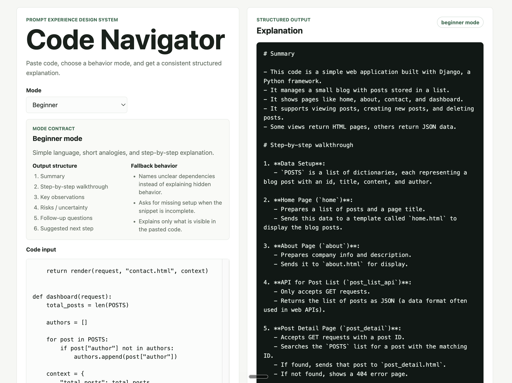

# Code Navigator

AI-powered code explanation tool that lets users paste code and choose an explanation mode: Beginner, Debug, or Architecture. Each mode uses tailored prompt behavior to generate different styles of structured responses, from simple step-by-step explanations to technical debugging insights and system-level architecture overviews.



## AI Generation Disclosure

This project was generated and implemented with AI assistance as part of a portfolio exercise. It is intended to demonstrate prompt experience design, structured AI interaction patterns, and product thinking around LLM behavior. The code was not hand-written end to end by the portfolio owner.

## Project Focus

Code Navigator is not a generic chatbot. It demonstrates how an LLM can be shaped into a predictable interface for understanding code through:

- mode-specific system behavior
- structured output formats
- explicit fallback and uncertainty handling
- consistent response contracts

## Run Locally

### Prerequisites

- Node.js 18 or newer
- An OpenAI API key with available API quota

### Setup

Clone the repository:

```bash
git clone https://github.com/yuvalhashmonay/code-navigator.git
cd code-navigator
```

Create a local environment file:

```bash
cp .env.example .env
```

Edit `.env` and replace the placeholder with your real API key:

```bash
OPENAI_API_KEY=sk-your-real-key-here
OPENAI_MODEL=gpt-4.1-mini
```

Start the app:

```bash
npm run start
```

Open the app in a browser:

```text
http://localhost:3000
```

### Notes

- `.env` is intentionally ignored by git so API keys are not committed.
- The app will load without an API key, but analysis requests require `OPENAI_API_KEY`.
- If the OpenAI account has no available quota, the UI will show the API error returned by OpenAI.
